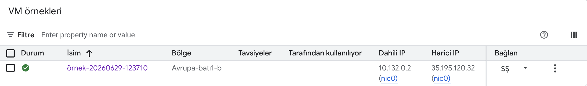
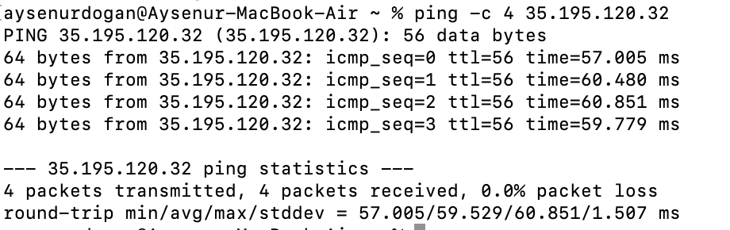
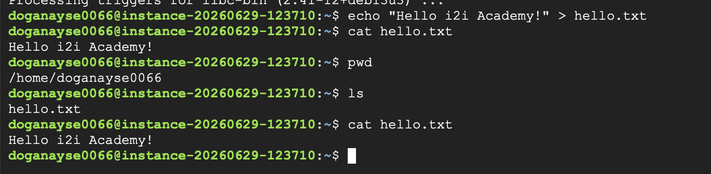

# i2i-Academy-IntroductionToCloud-1

## Introduction to Cloud - Homework 1

This repository contains my solution for the Introduction to Cloud homework.

---

## Objective

The goal of this homework was to:

- Create a Virtual Machine on Google Cloud Platform
- Verify connectivity using Ping
- Connect to the VM using SSH
- Create a file named `hello.txt`
- Verify the file contents

---

## VM Instance

A Debian Virtual Machine was successfully created on Google Cloud Platform.



---

## Ping Test

The virtual machine was successfully reached from my local computer using the `ping` command.



---

## SSH Connection

The virtual machine was accessed successfully using SSH.

Commands executed:

```bash
echo "Hello i2i Academy!" > hello.txt
cat hello.txt
```



---

## Result

The virtual machine was successfully created and accessed remotely. The required file was created and verified successfully.
